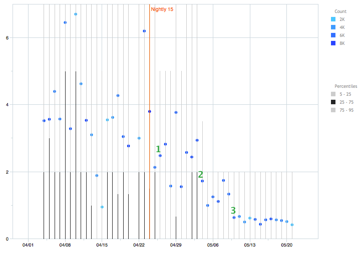

Once upon a time, I wanted to add telemetry for counting the number of zombie compartments present in an instance of Firefox.

The trouble is, it's hard to write code which can tell whether a compartment is a zombie.  Our manual procedure for finding zombies involves closing most of your open tabs.  But of course we can't close all your tabs every time we want to record the number of zombies for telemetry.

This is a story of the creature which solved that problem, and how we used it to verify a large bugfix.

## A false start

My solution to the zombie-identification problem was to give up on it.

Instead, I realized that (almost?) all compartment leaks are due to leaks of DOM windows.  So perhaps we could identify leaked windows instead of leaked compartments.

I quickly gave up on that, too.  It's hard to tell for sure whether a window is leaked.  For example, suppose a page does

    window.my_popup = window.open('http://mozilla.org');
    window.my_popup.close();

The mozilla.org window will now live until we close the top-level page (or until the page clears `window.my_popup`).

This situation is difficult to distinguish from the case when Firefox chrome JS code (either baked into Firefox or from an add-on) holds a reference to the `mozilla.org` window.  But in the first case, it's (potentially) a bug in a page, while in the second case, it's a bug in Firefox.  We need to distinguish between these cases in order to have a reasonable notion of "leaked window".

My next realization was that I could get somewhere by expecting less of myself.  Enter ghost windows.

## Ghost windows

If my goal is to collect telemetry on the number of leaked windows, I don't have to identify every single leak with zero false positives.  If I were instead to capture the "obvious" leaks with a relatively low false-positive rate, that would still be an interesting number.

Ghost windows are an attempt to capture "obviously" leaked windows.  We say that a window is a ghost if it meets three criteria:

  1. The window's docshell is null, which basically means it is not part of any tab.

  2. All other windows from the same top-level origin also meet criterion (1) above.  (That is, if you have a tab open to `http://mozilla.org`, then a window from `http://people.mozilla.org` will never be a ghost.)

  3. The window has met the two criteria above for at least 60 seconds.

The experienced zombie hunter may notice that these are basically the same criteria that one uses when looking for zombie compartments by hand.

Criterion (3) is in place because windows don't get destroyed immediately once they become garbage; it takes potentially multiple runs of the garbage and cycle collectors to destroy a window, and we don't want to flag a window as a ghost until we believe it's survived a sufficient number of collection attempts.

Criterion (2) tries to exclude the case when a page keeps a window alive, as in the `window.my_popup` example above.  A page can keep a window from any origin alive, but my hope was that most of the time, pages would touch windows only from the same top-level origin.  (For example, `mail.google.com` might keep alive `plus.google.com`, but hopefully not `bing.com`.)

This is a crude heuristic, but it seems to work well enough: I get few false positives in practice.

Notice that criterion (2) means that a ghost window can appear and disappear as you browse.  If you have a leaked `nytimes.com` window, it will disappear as a ghost window as soon as you open a new tab to `nytimes.com`.  It's this behavior that suggested the name "ghost".  Again, this is OK because the goal is just to capture the obviously leaked windows.

One final note: You can view the list of ghost windows in about:compartments.  There, we waive the 60-second waiting period, because loading about:compartments triggers a set of GC/CCs which should collect all garbage windows.

So now that we have ghost windows, let's use them.

## Telemetry or: How I Learned to Stop Worrying and Love Add-Ons

You may have heard that Kyle Huey landed a [big add-on leak fix][the-fix] for
Firefox 15.  We believe that his patch eliminates the vast majority of window
leaks due to add-ons, and in our experience, leaked windows are the most common
and the most severe type of add-on leak.

You may also have heard that Kyle's fix caused new leaks with add-ons built
against old versions of the Jetpack SDK, and that we later
[fixed this problem][jetpack-fix].

I wanted to verify whether these changes actually had the effect we expected,
and thankfully, I'd landed telemetry for ghost windows a few weeks before, so
we could observe how his patches changed this measure.

Here's the plot.  (This is data from Firefox nightlies on Windows.)

There are three points of interest here:

   1. 4/26 &mdash; Kyle's first patch landed.

   Despite the fanfare surrounding its landing, this was actually the smallest
   change of the three.  There's little to no change in the mean number of
   ghost windows (the blue dots), but there is a drop in the 75th percentile
   (top of the black vertical lines).

   2. 5/4 &mdash; This was an unexpected drop.  My best guess is that it was
   caused by [bug 751561][], because that's the only change in the
   [changeset range][] which seems plausible.

   We don't have a good explanation for why this change affected the number of
   ghost windows.

   3. 5/10 &mdash; Kyle's second patch landed, fixing the jetpack issues.

(If you want to look at the latest data, go [here][telemetry-dash], sign in
with any <strike>BrowserID</strike> Mozilla Persona account, click "telemetry
evolution", then select `GHOST_WINDOWS` in the drop-down.)

This data is surprising, and not just because of the drop on 5/4 that we can't
explain.  I expected a big drop after Kyle's first patch and a small drop after
his second one, but we observed the opposite.

I don't know exactly what that means, but I'd guess either a lot of our nightly
testers were using add-ons built with old versions of the Jetpack SDK, or the
Jetpack fix also fixed other problems we weren't aware of.

I think we can conclude from this data that we're in a much better state now
with respect to ghost windows than we were.  This data is also evidence that
counting ghost windows actually measures leaks in Firefox.

## Is ghost windows the right metric?

I think it's reasonable at this point to ask: Why bother with telemetry for
ghost windows?  Couldn't I &mdash; in fact, *shouldn't* I &mdash; have looked
at actual memory usage, in the form of resident set size (RSS)?

Of course RSS is an important metric, but there are a few reasons ghost windows
are a reasonable thing to look at:

   * RSS is noisy.
   
   There may have been a drop in RSS numbers since we landed these fixes, but
   the data is noisy enough that I couldn't use the RSS data to prove that we
   fixed anything.  In contrast, the trend in the ghost windows data is clear.

   * Leaked windows are harmful even when they don't perceptibly increase
   memory usage.
   
   In particular, leaked windows can cause cycle collector times to increase,
   because as soon as a window's docshell becomes null, the cycle collector
   thinks it may be garbage and tries to collect it.  In its vain effort to
   collect the leaked window, the CC traces every DOM node attached to the
   window, causing longer CC pauses.

The lesson here is that, for verifying fixes, specific measurements are often
more useful than general ones.  Since you probably want at least a week's worth
of baseline data, verifying fixes can take some planning!

## Remaining work

Ghost windows were developed before [compartment-per-global][CPG].  With CPG,
it may be possible to remove ghost window criterion (2), which would be great.

We have one other add-on related bug on our plate at the moment.  It turns out
that our [FUEL API][] never frees most of the objects it creates. And under
some circumstances, it creates a *lot* of objects.

There are patches [in the bug][FUEL bug] awaiting review; I hope we'll have
this fixed for Firefox 15 or 16.

The fact that FUEL has been leaking for a long time
([since 2007?][FUEL checkin]) suggests to me that there may be other dark
corners of Firefox which are similarly problematic.

But the bottom line is, we're making progress.  I'm hopeful that many users
with leaky add-ons will find Firefox 15 to be a noticeable improvement.

[the-fix]: http://blog.mozilla.org/nnethercote/2012/05/07/update-on-leaky-add-ons/
[jetpack-fix]: http://blog.mozilla.org/nnethercote/2012/05/15/additional-update-on-leaky-add-ons/
[bug 751561]: https://bugzilla.mozilla.org/show_bug.cgi?id=751561
[changeset range]: https://hg.mozilla.org/mozilla-central/pushloghtml?fromchange=807403a04&tochange=2db9df428
[FUEL API]: https://developer.mozilla.org/en/FUEL
[FUEL bug]: https://bugzilla.mozilla.org/show_bug.cgi?id=750454
[FUEL checkin]: http://hg.mozilla.org/mozilla-central/rev/454242ccdff6#l6.51
[CPG]: http://bholley.wordpress.com/2012/05/04/at-long-last-compartment-per-global/
[telemetry-dash]: http://mzl.la/telemetrydash
