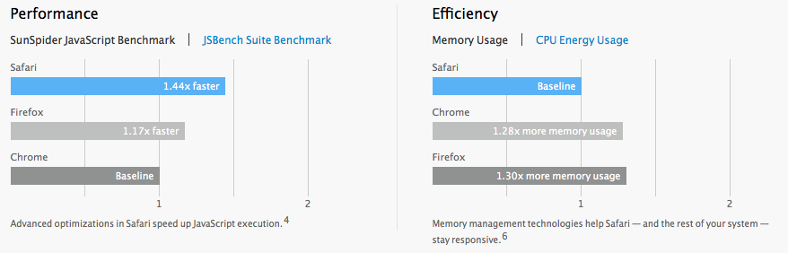

[Apple's page describing Mac OS 10.9][apple] contains a comparison of the
performance of Safari, Chrome, and Firefox.  I've reproduced it below since I
expect Apple will take the page down soon.

The data is bunk, of course.  SunSpider is a terrible benchmark, and without
workloads specified for the memory usage and power consumption measurements,
the results mean nothing.

(In case you're wondering, the footnotes referenced under the graph specify the
hardware and browser versions used.  They also say that "Performance will vary
based on system configuration, network connection, and other factors," which
reminds me of the first frame of [this xkcd][xkcd].)

But to focus on the crappy benchmarking here would miss the point: Did you
notice that **Safari's memory usage gets equal billing with its JS speed**?
That's amazing!  Just a few years ago, nobody talked about memory usage.  I'd
like to think we (and in particular [Nick][]) can take some credit for that.

[apple]: http://www.apple.com/osx/preview/#safari
[xkcd]: http://xkcd.com/870/
[Nick]: http://blog.mozilla.org/nnethercote/
